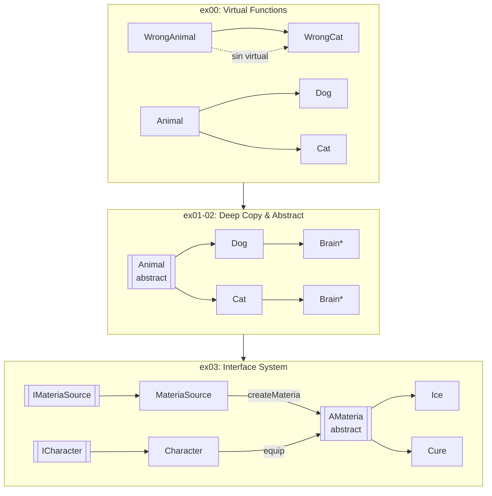

# CPP Module04 - Polymorphism, Abstraction & Interfaces


## Descripción

Proyecto educativo del currículo de 42 School que domina los pilares avanzados de la Programación Orientada a Objetos en C++: **polimorfismo dinámico**, **clases abstractas**, **interfaces puras** y **copias profundas**. Cuatro ejercicios progresivos que van desde funciones virtuales hasta un sistema completo de Materias inspirado en Final Fantasy.

## Características Principales

- **Polimorfismo Dinámico**: Implementación correcta de `virtual` functions y destructores, demostrando la diferencia entre binding estático (WrongAnimal) y dinámico (Animal).
- **Deep Copy con Composición**: Clase `Brain` con array de 100 ideas, implementando Orthodox Canonical Form con copy constructor y assignment operator.
- **Clases Abstractas**: `Animal` con `makeSound() = 0` como clase abstracta pura, previniendo instanciación directa.
- **Sistema de Interfaces Completo**: Arquitectura tipo Final Fantasy con `IMateriaSource`, `ICharacter`, `AMateria`, `Ice`, `Cure` y gestión de inventario limitado (4 slots).

## Stack Tecnológico

| Tecnología | Propósito |
|------------|-----------|
| C++98 | Standard del lenguaje (strict mode) |
| g++ | Compilador GCC |
| Makefile | Build system automatizado con dependencias |

## Decisiones Técnicas / Arquitectura

El proyecto sigue una **progresión pedagógica intencional**:

1. **Ex00 - Virtual Functions**: Se contrasta `Animal` (con virtual) vs `WrongAnimal` (sin virtual). Esto demuestra el problema del object slicing y por qué los destructores virtuales son críticos en jerarquías.

2. **Ex01-02 - Deep Copy**: La composición (`Brain* brain`) fuerza la implementación manual del Orthodox Canonical Form. Sin deep copy, múltiples animales compartirían el mismo cerebro.

3. **Ex03 - Interfaces**: Inspirado en Final Fantasy, implementa el patrón Factory: `MateriaSource::createMateria()` clona materias aprendidas. `Character` equipa hasta 4 materias. Las interfaces puras (`IMateriaSource`, `ICharacter`) desacoplan completamente los componentes.

## Diagrama de Arquitectura



## Guía de Instalación

```bash
# Clonar el repositorio
git clone https://github.com/samuelhm/CPP-MODULE-04.git
cd CPP-MODULE-04

# Ejecutar ejercicio 00 (Polimorfismo)
cd ex00 && make && ./Animals

# Ejecutar ejercicio 01 (Deep Copy)
cd ../ex01 && make && ./Animals

# Ejecutar ejercicio 02 (Abstract Classes)
cd ../ex02 && make && ./Animals

# Ejecutar ejercicio 03 (Sistema de Interfaces)
cd ../ex03 && make && ./Animals

# Limpiar archivos objeto
make clean

# Limpiar todo (incluyendo ejecutables)
make fclean && make re
```

## Estructura del Proyecto

```
CPP-MODULE-04/
├── ex00/                          # Polimorfismo básico
│   ├── Makefile
│   └── src/
│       ├── Animal/                # Clase base con virtual
│       ├── Dog/, Cat/             # Derivadas correctas
│       ├── WrongAnimal/           # Sin virtual (demo error)
│       └── WrongCat/              # Comportamiento incorrecto
├── ex01/                          # Deep copy con Brain
│   └── src/ { Animal, Dog, Cat, Brain }
├── ex02/                          # Abstract classes (= 0)
│   └── src/ { Animal, Dog, Cat, Brain }
└── ex03/                          # Sistema de Interfaces
    └── src/
        ├── interfaces/            # IMateriaSource, ICharacter
        ├── AMateria/              # Abstract base
        ├── Ice/, Cure/            # Materias concretas
        ├── Character/            # Implementa ICharacter
        └── MateriaSource/        # Factory de Materias
```

## Conceptos Clave

| Concepto | Implementación |
|----------|----------------|
| Virtual Destructor | `virtual ~Animal()` previene memory leaks en polimorfismo |
| Pure Virtual | `virtual void makeSound() const = 0` crea clase abstracta |
| Deep Copy | Copy constructor + `operator=` copian `Brain* ideas[100]` |
| Interface | Clase con solo métodos `=0` y destructor virtual |
| Orthodox Canonical Form | Constructor + Copy + Assignment + Destructor |
| Factory Pattern | `MateriaSource::createMateria()` clona por tipo |

## Contacto

[](https://github.com/samuelhm/)
[](https://www.linkedin.com/in/shurtado-m/)