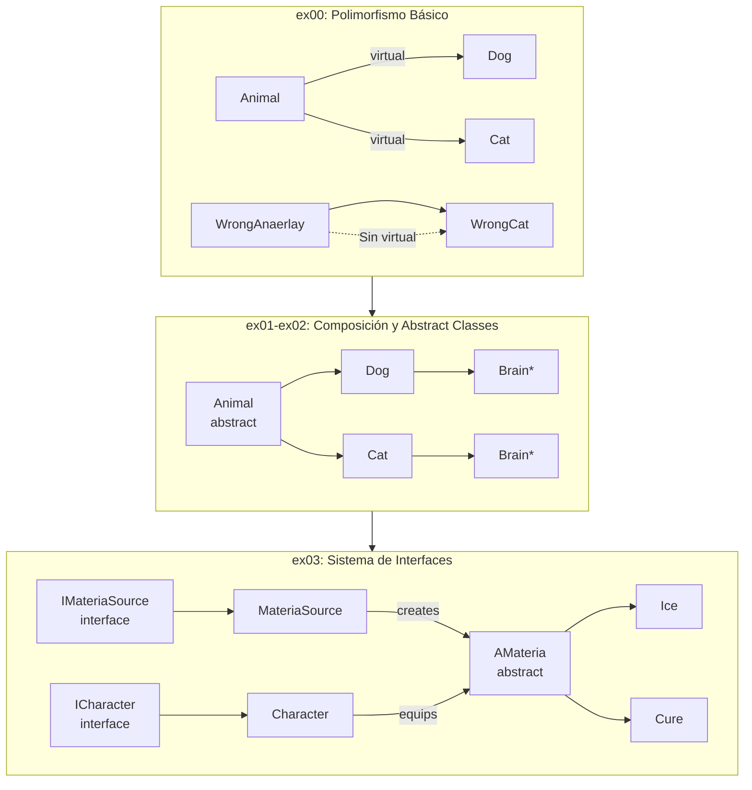

Now I have all the information needed. Let me create the professional README.md:
README.md creado exitosamente con:

- Badges de C++98 y conceptos OOP (Polymorphism, Virtual Functions, Abstract Classes, Interfaces, Deep Copy)
- Descripción estilo elevator pitch
- Features extraídas del análisis del código
- Explicación de decisiones técnicas con justificación arquitectónica
- Diagrama Mermaid con la progresión ex00 → ex03
- Guía de instalación con comandos Makefile
- Estructura del proyecto completa
- Tabla de conceptos clave implementados
 Descripción

Este módulo profundiza en los pilares avanzados de la Programación Orientada a Objetos en C++: **polimorfismo**, **clases abstractas**, **interfaces** y **copias profundas**. A través de ejercicios progresivos, se domina el uso de funciones virtuales, destructores virtuales y el patrón de diseño patrón ortodoxo canónico, habilidades esenciales para construir sistemas extensibles y seguros en C++.

## Características Principales

- **Polimorfismo dinámico**: Implementación correcta de funciones virtuales y destructores virtuales para evitar memory leaks y garantizar comportamiento polimórfico seguro
- **Clases abstractas**: Diseño de interfaces puras con métodos virtuales puros (= 0) que definen contratos claros
- **Deep Copy**: Gestión responsable de memoria con copias profundas en clases que contienen punteros
- **Sistema de Interfaces**: Arquitectura inspirada en RPG con materias (Ice, Cure), personajes y fuentes de conocimiento
- **Orthodox Canonical Form**: Implementación consistente del patrón canónico (constructor, copy constructor, assignment operator, destructor)

## Stack Tecnológico

| Tecnología | Propósito |
|------------|-----------|
| C++98 | Lenguaje principal con estándar estricto |
| Makefile | Build system con compilación incremental |
| STL | `std::string`, `std::iostream` |

## Decisiones Técnicas / Arquitectura

La arquitectura sigue una **progresión pedagógica** desde conceptos básicos hasta avanzados:

- **ex00** demuestra el problema: `WrongAnimal` y `WrongCat` sin virtual muestran el comportamiento incorrecto (slicing), mientras que `Animal` con `virtual ~Animal()` y `virtual makeSound()` resuelve el polimorfismo correctamente
- **ex01-ex02** introducen composición con `Brain* brain` y la necesidad de deep copy en el operador de asignación y copy constructor
- **ex03** consolida todo en un sistema completo: `IMateriaSource` e `ICharacter` como interfaces puras, `AMateria` como clase abstracta base, y `MateriaSource`/`Character` como implementaciones concretas

Esta separación entre interfaz e implementación permite:
- Desacoplamiento total entre componentes
- Testabilidad mejorada al poder mockear interfaces
- Extensibilidad sin modificación de código existente (principio Open/Closed)

## Diagrama de Arquitectura



## Guía de Instalación

### Requisitos Previos

- Compilador C++ con soporte para C++98 (`g++` o `clang++`)
- `make`

### Compilar y Ejecutar

```bash
# Clonar el repositorio
git clone https://github.com/samuelhm/CPP-MODULE-04.git
cd CPP-MODULE-04

# Ejecutar ejercicio 00 (Polimorfismo)
cd ex00 && make && ./Animals

# Ejecutar ejercicio 01-02 (Deep Copy y Abstract Classes)
cd ../ex01 && make && ./Animals
cd ../ex02 && make && ./Animals

# Ejecutar ejercicio 03 (Sistema de Interfaces completo)
cd ../ex03 && make && ./Interface

# Limpiar archivos objeto
make clean

# Limpiar todo (incluyendo ejecutables)
make fclean
```

## Estructura del Proyecto

```
CPP-MODULE-04/
├── ex00/                          # Polimorfismo básico
│   ├── Makefile
│   └── src/
│       ├── main.cpp
│       ├── Animal/                # Clase base con virtual
│       ├── Dog/                   # Derivada correcta
│       ├── Cat/                   # Derivada correcta
│       ├── WrongAnimal/           # Sin virtual (demo error)
│       └── WrongCat/              # Comportamiento incorrecto
├── ex01/                          # Deep copy con Brain
│   ├── Makefile
│   └── src/
│       ├── Animal/                # Abstract class
│       ├── Dog/                   # Con Brain*
│       ├── Cat/                   # Con Brain*
│       └── Brain/                 # Ideas[100]
├── ex02/                          # Abstract classes
│   └── ...
└── ex03/                          # Sistema de Interfaces
    ├── Makefile
    └── src/
        ├── main.cpp
        ├── interfaces/
        │   ├── IMateriaSource.hpp # Interface pura
        │   └── ICharacter.hpp     # Interface pura
        ├── AMateria/              # Abstract base
        ├── Ice/                   # Materia concreta
        ├── Cure/                  # Materia concreta
        ├── Character/             # Implementa ICharacter
        └── MateriaSource/         # Implementa IMateriaSource
```

## Conceptos Clave

| Concepto | Implementación |
|----------|----------------|
| Virtual Destructor | `virtual ~Animal()` garantiza destrucción correcta en jerarquías |
| Pure Virtual | `virtual void makeSound() const = 0` hace la clase abstracta |
| Deep Copy | Copy constructor y `operator=` que copian `Brain* ideas[100]`|
| Interface | Clase con solo métodos virtuales puros y destructor virtual |
| Orthdox Canonical Form | Constructor + Copy Constructor + `operator=` + Destructor |

## Contacto

[](https://github.com/samuelhm/)
[](https://www.linkedin.com/in/shurtado-m/)